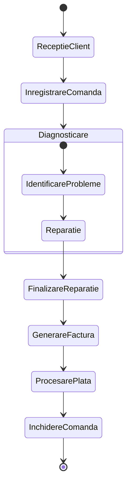
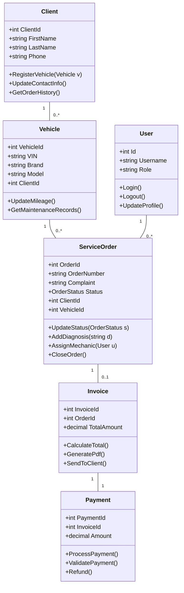

# Diagrame UML - Aplicație Management Service Auto (sdsAUTO)

Acest document conține diagramele UML actualizate, unde **Administratorul** deține toate drepturile sistemului, iar **Utilizatorul** are acces limitat la operațiunile de bază.

---

## 1. Descriere Comportamentală

### 1.1 Diagrama Use-Case (Imagine Generală)
Administratorul moștenește toate funcționalitățile Utilizatorului, având în plus acces la gestionarea sistemului și a rapoartelor avansate.

```mermaid
useCaseDiagram
    actor "User" as BaseUser
    actor "Utilizator" as UserActor
    actor "Administrator" as Admin

    BaseUser --> UserActor
    BaseUser --> Admin

    package "Sistem Management Service Auto (sdsAUTO)" {
        usecase "Autentificare & Autorizare" as UC1
        usecase "Gestionare Clienți" as UC3
        usecase "Gestionare Vehicule" as UC4
        usecase "Creare Comandă Service" as UC5
        usecase "Actualizare Status & Diagnostic" as UC7
        usecase "Configurare Profil Personal" as UC13
        usecase "Gestionare Utilizatori" as UC2
        usecase "Generare Factură & Plăți" as UC9
        usecase "Vizualizare Rapoarte" as UC11
        usecase "Configurare Parametri Sistem" as UC12
        usecase "Vizualizare Loguri Sistem (Logs)" as UC14
    }

    UserActor --> UC1
    UserActor --> UC3
    UserActor --> UC4
    UserActor --> UC5
    UserActor --> UC7
    UserActor --> UC13

    Admin --> UC2
    Admin --> UC9
    Admin --> UC11
    Admin --> UC12
    Admin --> UC14
```

### 1.2 Diagrama de Activitate (Flux Procesare Comandă)
Fluxul de lucru rămâne neschimbat, fiind procesul operațional standard al service-ului.



---

## 2. Descriere Structurală

### 2.1 Diagrama de Clase
Administratorul și Utilizatorul sunt diferențiați prin câmpul `Role`.


