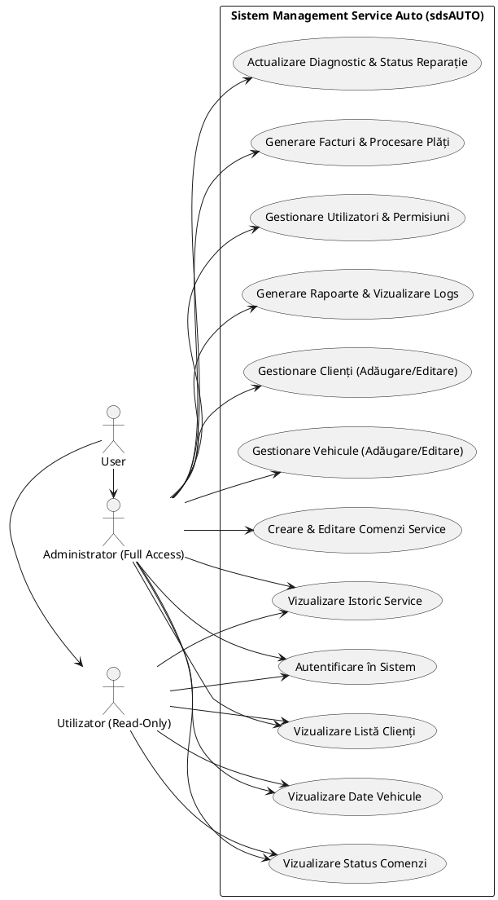
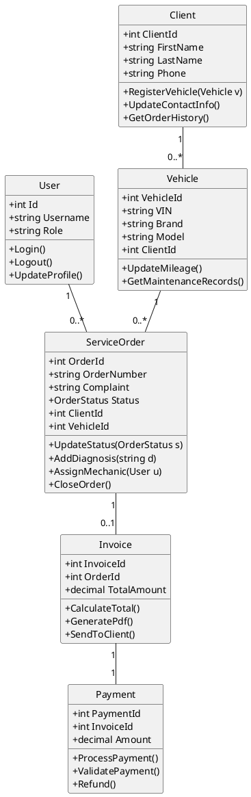
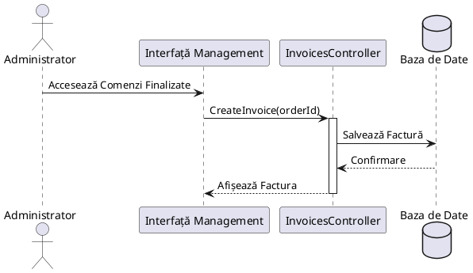

# Cod PlantUML - Diagrame sdsAUTO (Ierarhie Admin/User)

În această variantă, **Administratorul** deține controlul total, moștenind toate permisiunile **Utilizatorului**, plus funcționalități exclusive de management.

---

## 1. Diagrama Use-Case

---

## 2. Diagrama de Clase

---

## 3. Diagrama de Secvență (Generare Factură de către Admin)

